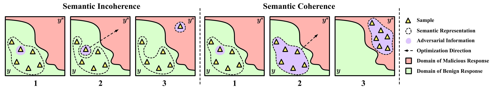

<div align="center">

# Semantic Representation Attack <br> against Aligned Large Language Models

</div>

<div align="center">


</div>

<!-- Three language version (Eng/Chinese/Japanese)  -->


<!-- markdown-toc start - Don't edit this section. Run M-x markdown-toc-refresh-toc -->
## Table of Contents

- [Introduction](#introduction)
- [Overview](#overview)
- [Quick Start](#quick-start)
  - [Installation](#installation)
  - [Full Workflow to Run SRA](#full-workflow-to-run-sra)
  - [Using your own models in HarmBench](#-using-your-own-models-in-harmbench)
  - [Using your own red teaming methods in HarmBench](#-using-your-own-red-teaming-methods-in-harmbench)
- [Acknowledgements](#acknowledgements)
- [Citation](#citation)

<!-- markdown-toc end -->


## Introduction

Large Language Models (LLMs) increasingly employ alignment techniques to prevent harmful outputs. Despite these safeguards, attackers can circumvent them by crafting prompts that induce LLMs to generate harmful content. Current methods typically target exact affirmative responses, suffering from limited convergence, unnatural prompts, and high computational costs. We introduce semantic representation attacks, a novel paradigm that fundamentally reconceptualizes adversarial objectives against aligned LLMs. Rather than targeting exact textual patterns, our approach exploits the semantic representation space that can elicit diverse responses that share equivalent harmful meanings. This innovation resolves the inherent trade-off between attack effectiveness and prompt naturalness that plagues existing methods. Our Semantic Representation Heuristic Search (SRHS) algorithm efficiently generates semantically coherent adversarial prompts by maintaining interpretability during incremental search. We establish rigorous theoretical guarantees for semantic convergence and demonstrate that SRHS achieves unprecedented attack success rates (89.4% averaged across 18 LLMs, including 100% on 11 models) while significantly reducing computational requirements. Extensive experiments show that our method consistently outperforms existing approaches.


## Overview
<div align="center">



</div>

Illustration of vanilla attacks under Semantic Incoherence and our Semantic Representation Attack under Semantic Coherence. Vanilla methods optimize for specific textual outputs, producing semantically incoherent prompts limited to a single response pattern. Our approach maintains coherence during optimization, enabling convergence to equivalent semantic representations across lexical variations, which provides multiple viable optimization paths and enhances attack performance.

## Quick Start 

### Installation

We recommend creating a conda environment as follows:

```bash
conda env create -f environment.yml
conda activate harmbench
```

All required packages for SRA are listed in `environment.yml`. 
Then

```bash
git clone https://github.com/JiaweiLian/SRA.git
cd SRA
pip install -r requirements.txt
python -m spacy download en_core_web_sm
```

For HarmBench installation and usage, see the [HarmBench documentation](https://github.com/centerforaisafety/HarmBench).

### Full Workflow to Run SRA

1. **Generate test cases (step1):**
  ```bash
  python scripts/run_pipeline.py --methods SRA --models <target_model> --step 1 --mode slurm
  ```

2. **Merge test cases (step1.5):**
  ```bash
  python scripts/run_pipeline.py --methods SRA --models <target_model> --step 1.5 --mode local
  ```

3. **Supplement results (optional, if needed):**
  ```bash
  python tools/supplement_results_sra.py --file_path <merged_json_file>
  ```

4. **Calculate ASR:**
  ```bash
  python tools/asr_sra.py --file_path <supplemented_json_file>
  ```

---

### Using your own models in HarmBench
You can easily add new Hugging Face transformers models in [configs/model_configs/models.yaml](configs/model_configs/models.yaml) by simply adding an entry for your model. This model can then be directly evaluated on most red teaming methods without modifying the method configs (using our dynamic experiment config parsing code, described in [./docs/configs.md](./docs/configs.md)). Some methods (AutoDAN, PAIR, TAP) require manually adding experiment configs for new models.
<!-- Additional details on how to add new models are in [./docs/adding_models.md](./docs/adding_models.md) -->

### Using your own red teaming methods in HarmBench
All of our red teaming methods are implemented in [baselines](baselines), imported through [baselines/__init__.py](baselines/__init__.py), and managed by [configs/method_configs](configs/method_configs). You can easily improve on top of existing red teaming methods or add new methods by simply making a new subfolder in the `baselines` directory. New attacks are required to implement the methods in the `RedTeamingMethod` class in `baselines/baseline.py`.
<!-- Additional details on how to add new red teaming methods are in [./docs/adding_methods.md](./docs/adding_methods.md) -->

## Acknowledgements

This project is built on top of the [HarmBench](https://github.com/centerforaisafety/HarmBench) framework. We are grateful to the HarmBench team for providing a standardized evaluation framework for automated red teaming. 

## Citation

If you find our SRA work useful in your research, please consider citing our [paper](https://arxiv.org/pdf/2509.19360):
```
@article{lian2025semantic,
  title={Semantic Representation Attack against Aligned Large Language Models},
  author={Lian, Jiawei and Pan, Jianhong and Wang, Lefan and Wang, Yi and Mei, Shaohui and Chau, Lap-Pui},
  journal={Advances in neural information processing systems},
  year={2025}
}
```
